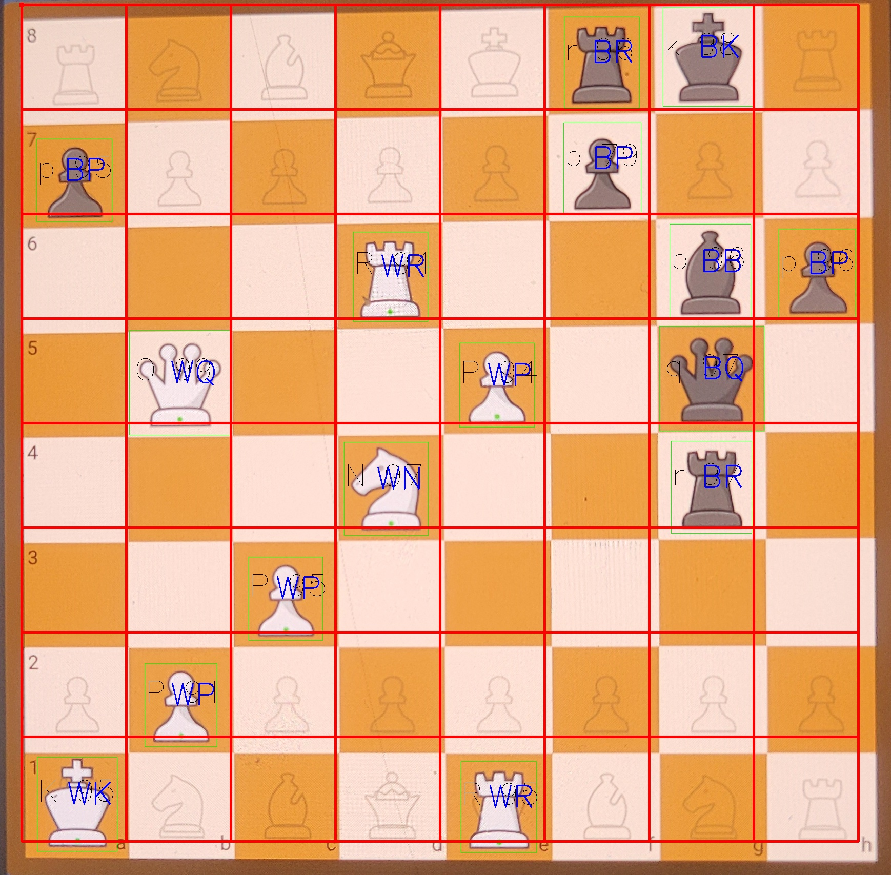
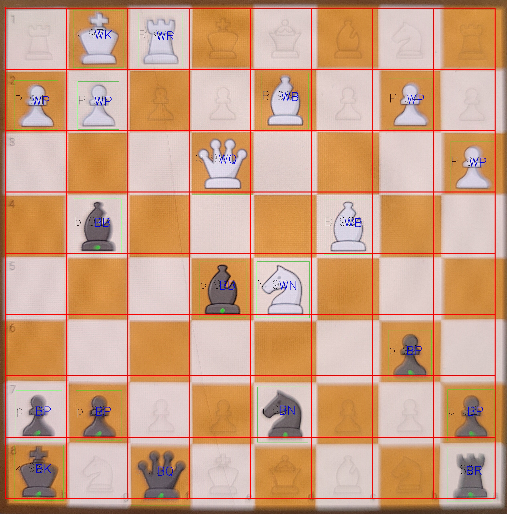

# chess-board-detector
This project uses YOLOv8 object detection to detect chess pieces from a board image and automatically generate the FEN (Forsyth–Edwards Notation) representation of the position. It also saves a labeled image with piece names on each square.


# ♟️ Chess Piece Detection & FEN Generator using YOLOv8  

 
 
  

This project detects **chess pieces on a board image** using a trained **YOLOv8 model** and generates the corresponding **FEN (Forsyth–Edwards Notation)**.  
It also saves a **labeled image** with piece names on each square for better visualization.

---

## 🚀 Features
✅ Detects **12 chess pieces** (white & black) using YOLOv8  
✅ Converts board state to **FEN notation**  
✅ Prints a **readable 8×8 board with piece names**  
✅ Saves an **image with bounding boxes and piece labels**  

---

## Installation
git clone https://github.com/Akshay7623/chess-board-detector
cd chess-fen-detector
pip install ultralytics opencv-python

▶️ Usage:

---

from detect_fen import predict_fen_code
predict_fen_code("board.jpg")

---

### ✅ Labeled Image


### ✅ Labeled Image


## 📂 Dataset Structure


### Dataset YAML
```yaml
path: /path/to/chess
train: images/train
val: images/val

names:
  0: Black Bishop
  1: Black King
  2: Black Knight
  3: Black Pawn
  4: Black Queen
  5: Black Rook
  6: Shadow
  7: White Bishop
  8: White King
  9: White Knight
  10: White Pawn
  11: White Queen
  12: White Rook


